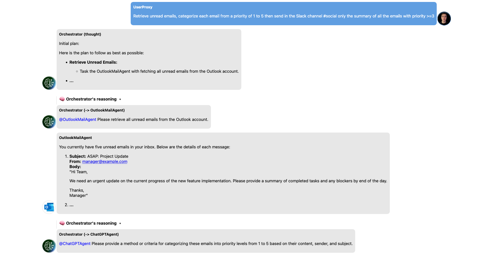
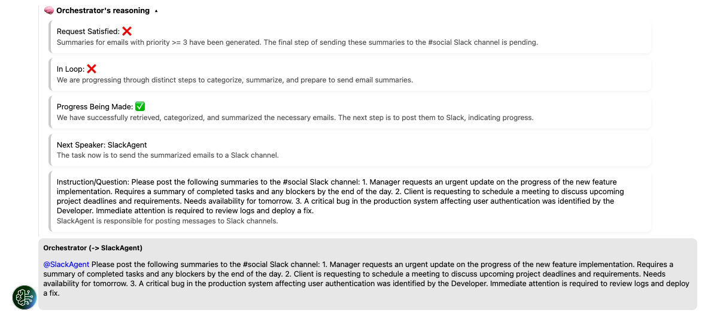
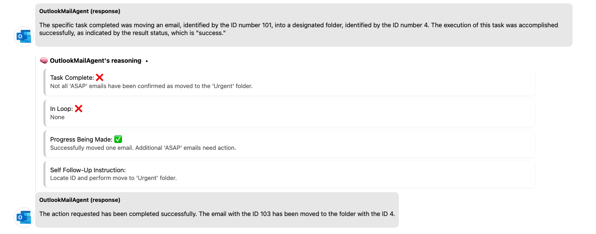

# AgentFlow: Reinventing Workflow Automation with Agentic AI



AgentFlow is an agentic application designed to automate real-world workflows using LLM-powered agents. Built on top of the Magentic-One, AgentFlow enables users to describe their goals in natural language while a team of intelligent agents translates, plans, and executes the required actions across real-world services like Outlook, Jira, Slack, and more.

For a more comprehensive understanding of AgentFlow's architecture, methodology, and research foundations, please refer to the [Thesis project](https://thesis.unipd.it/retrieve/af828c2b-db56-4c30-8a3b-df22fe5345ce/Bacchin_Francesco.pdf) that documents the architecture and experimental results behind this implementation.

## Agent-Based Task Execution

AgentFlow automates task execution by coordinating a set of LLM-powered agents through a central orchestrator. When a user submits a request via the UI, the orchestrator breaks it down into discrete steps (Task Ledger) and delegates them to the appropriate agents.



Each agent interacts with external APIs by executing specific functions and returning the result. The orchestrator tracks task progress using a Progress Ledger, allowing users to inspect the system’s reasoning at every step (e.g., which agent acts next, whether the task is complete, etc.).

## Multi-Turn Agents

Initially, agents would return control after a single action, even when multiple were needed, leading to inefficiencies and incomplete task execution. To solve this, agents now maintain an internal progress tracker and autonomously decide whether to continue executing further actions before handing control back.

After each action, the agent internally evaluates:

- Is the task completed?

- Is there progress?

- Are we stuck in a loop?

- What should be done next?

Only when the task is complete—or progress stalls—does the agent send a final summary back to the orchestrator. This improves performance and reliability, especially when using lighter models like GPT-4o-mini.



## Based on [Autogen-Magentic-One](https://github.com/microsoft/autogen/tree/main/python/packages/autogen-magentic-one)
This project is built on top of the paper [Magentic-One: A Generalist Multi-Agent System for Solving Complex Tasks](https://www.microsoft.com/en-us/research/articles/magentic-one-a-generalist-multi-agent-system-for-solving-complex-tasks/) by Microsoft.

This project follows the [MIT License](LICENSE).

## Setup and Usage

You can install the Magentic-One package and then run the example code to see how the agents work together to accomplish a task.

1. Clone the code and install the package:

    The easiest way to install is with the [uv package installer](https://docs.astral.sh/uv/getting-started/installation/) which you need to install separately, however, this is not necessary.

    Clone repo, use uv to setup and activate virtual environment:
    ```bash
    git clone https://github.com/microsoft/autogen.git
    cd autogen/python
    uv sync  --all-extras
    source .venv/bin/activate
    ```
   For Windows, run `.venv\Scripts\activate` to activate the environment.

2. Install magentic-one from source:
    ```bash
    cd packages/autogen-magentic-one
    pip install -e .
    ```

    The following instructions are for running the example with the GUI presented in the initial section:

3. Configure the environment variables for the chat completion client. See instructions below [Environment Configuration for Chat Completion Client](#environment-configuration-for-chat-completion-client).
4. In case you want to allow AI agents to interact with the APIs of Outlook, Jira, and Slack services, configure the environment variables following the format in the `.example.env` file.
If not, the APIs will be mocked, but you will still be able to see how the orchestrator and agents works.
5. Now you can run the example code to see how the agents work together to accomplish a task.

```bash
python examples/example_agentic_workflow_with_gui.py
```

### Environment Configuration for Chat Completion Client

This guide outlines how to structure the config to load a ChatCompletionClient for Magentic-One.

```python
from autogen_core.models import ChatCompletionClient

config = {}
client = ChatCompletionClient.load_component(config)
```

Currently, Magentic-One only supports OpenAI's GPT-4o as the underlying LLM.

#### Azure OpenAI service

To configure for Azure OpenAI service, use the following config:

```json
{
    "provider": "AzureOpenAIChatCompletionClient",
    "config": {
        "model": "gpt-4o-2024-05-13",
        "azure_endpoint": "https://{your-custom-endpoint}.openai.azure.com/",
        "azure_deployment": "{your-azure-deployment}",
        "api_version": "2024-06-01",
        "azure_ad_token_provider": {
            "provider": "autogen_ext.auth.azure.AzureTokenProvider",
            "config": {
                "provider_kind": "DefaultAzureCredential",
                "scopes": [
                    "https://cognitiveservices.azure.com/.default"
                ]
            }
        }
    }
}
```

This project uses Azure OpenAI service with [Entra ID authentcation by default](https://learn.microsoft.com/azure/ai-services/openai/how-to/managed-identity). If you run the examples on a local device, you can use the Azure CLI cached credentials for testing:

Log in to Azure using `az login`, and then run the examples. The account used must have [RBAC permissions](https://learn.microsoft.com/azure/ai-services/openai/how-to/role-based-access-control) like `Azure Cognitive Services OpenAI User` for the OpenAI service; otherwise, you will receive the error: Principal does not have access to API/Operation.

Note that even if you are the owner of the subscription, you still need to grant the necessary Azure Cognitive Services OpenAI permissions to call the API.

Or, to use an API key:
```json
{
    "provider": "AzureOpenAIChatCompletionClient",
    "config": {
        "model": "gpt-4o-2024-05-13",
        "azure_endpoint": "https://{your-custom-endpoint}.openai.azure.com/",
        "azure_deployment": "{your-azure-deployment}",
        "api_version": "2024-06-01",
        "api_key": "REPLACE_WITH_YOUR_API_KEY"
    }
}
```

#### With OpenAI

To configure for OpenAI, use the following config:

```json
{
  "provider": "OpenAIChatCompletionClient",
  "config": {
      "model": "gpt-4o-2024-05-13",
      "api_key": "REPLACE_WITH_YOUR_API_KEY"
  }
}
```

Feel free to replace the model with newer versions of gpt-4o if needed.